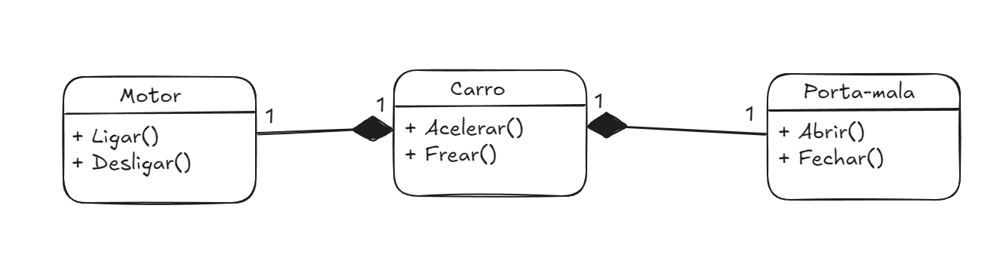
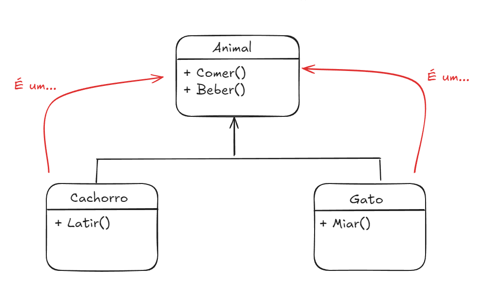

# Anotações

## Procedural vs POO
- Nas linguagens procedurais, podemos chamar funções e métodos, na POO só chamamos métodos (funções atreladas a objetos).
Ex:
JavaScript:`acelerar()`
Java: `Carro.acelerar()` (Isto é, se a classe previamente criada Carro tiver o método acelerar)

## Boas práticas
- Não faça nenhum print dentro da classe, ao invés disso retorne String, isso aumenta a flexibilidade da classe.

## Agregação e Composição
- **Agregação (independência)** = diamante em branco
- **Composição (dependência)** = diamante preenchido
- **CUIDADO: Quando a relacionamento com outra classe é N, indica um array (n instâncias da classe)**

## Agreg. e Compos. VS Herança
- No conceito de herança, podemos imaginar um diagrama "é um...",
- No conceito de agreg. e compos. a pergunta de associação "é um..." sempre será falso.

## Herança
- Atributos `protected` são privados para todas as classes, exceto as que suas filhas.

## Polimorfismo
- Se você não incluir um método específico na classe pai, ele não poderá ser aplicado com polimorfismo!
- Quando uma classe ou método estiver em _itálico_, ela é abstrata

## Interface
- A interface garante uma base para a implementação de uma classe que irá herdar dela.
- Por mais que seja parecido com o conceito das _classes abstratas_, as interfaces possuem algumas diferenças:
  - **Suportam herança múltipla**: isto é, uma classe pode implementar várias interfaces.
  - **Nunca possuirá atributos**: Interfaces obrigatoriamente não possuem atributos e nem contrutores.
  - **Só podem conter métodos abstratos**: Enquanto as _classes abstratas_ podem(opcionalmente) conter métodos concretos.
  